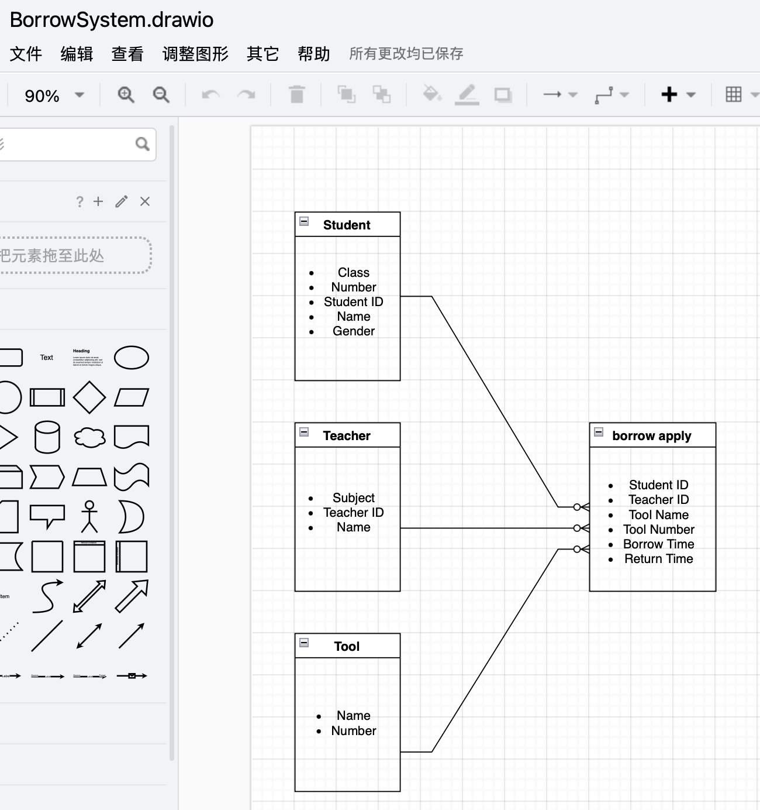

112-1 DataBase System
=============

>Teacher： Dr. Yun-Cheng Tsai 

>Name：Hsin-Ya Tsai

>Department & Grade： NTNU THARD Third year of graduate school

Note
-------------
### Ｗeek 1
[PPT](https://docs.google.com/presentation/d/1CP0D92DA8Ae8oyIKSquqUuTUpVqwLGT-14T32l9pf5U/edit#slide=id.g2410febba22_0_9)
[Video](https://www.youtube.com/watch?v=idhUbF1req4)
### Ｗeek 2
[PPT](https://docs.google.com/presentation/d/1amn8pDX2Wx4N6ZjzhCGoQFJH4DqaRcQ2DJAdg3hbIrA/edit#slide=id.g23dd2219a46_0_124)
[Video](https://youtu.be/qGaGgdm_YtY?si=BuJ-TQ-b7FKe3HkU)
### Ｗeek 3
[Enterprise Visit Record](https://www.facebook.com/pecu.tsai/posts/10222321136844048)
### Ｗeek 4
[PPT](https://docs.google.com/presentation/d/1053jwkOvLAdeQCDUJKq-c0NwxB3jOqlkiL244y0DPro/edit#slide=id.g23dd2219a46_0_124)
[Video](https://youtu.be/YjItfF4FkIo?si=Hsan9VU2aziBt_GR)
### Ｗeek 5
[PPT](https://docs.google.com/presentation/d/1J0ASP97LgjTQeKqTdm1vRhxh6MGya-C1D-8w7ykUPqE/edit#slide=id.g24f83c41742_0_0)
[Video](https://youtu.be/SkouS0krH98?si=OBXXqnpHeQNnR3lb)

HW
-------------
### Ｗeek 1
[HW0](https://youtu.be/QtKSeeiwIiA)
### Ｗeek 2
[HW1](https://youtu.be/gAz-3NpOgYU)

### Ｗeek 4
[HW2](https://youtu.be/uFGQFHxbDzg)
### Ｗeek 5
[HW3](https://youtu.be/EkUsSxCOEBw)

Project
-------------
